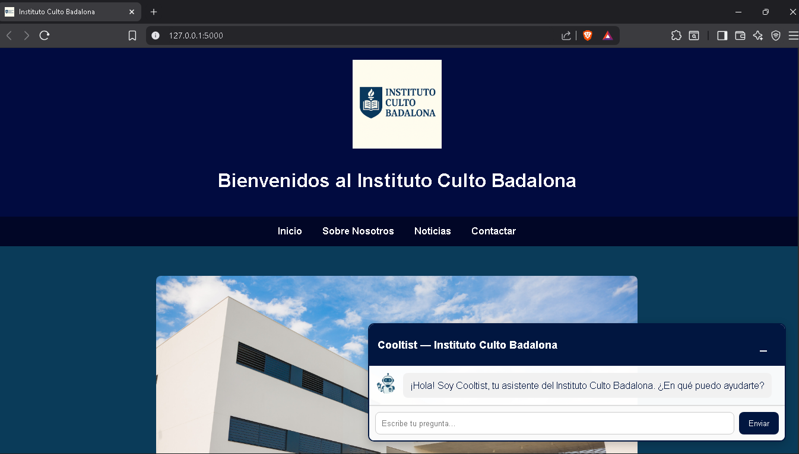
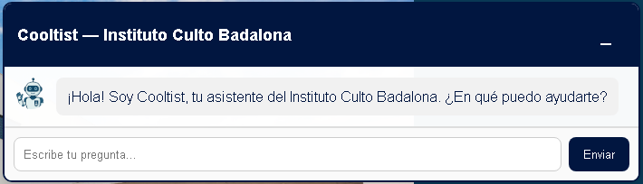
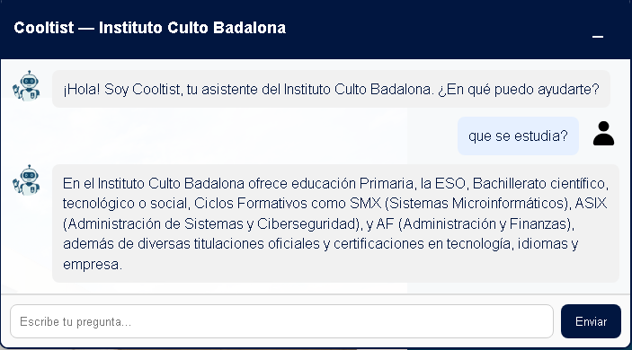
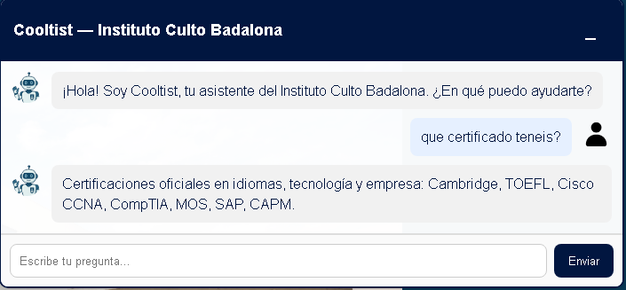
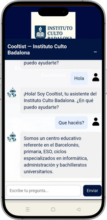
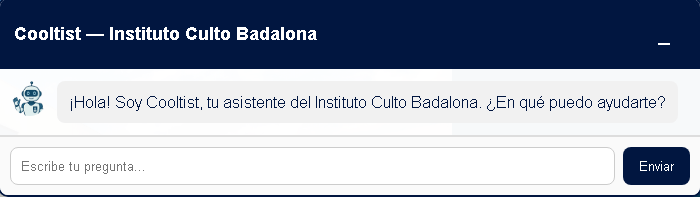
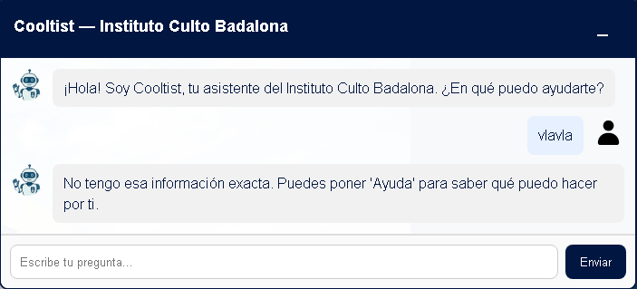

<h1>📘 Cooltist – Web Chatbot of the Culto Badalona Institute</h1>

<em>Virtual Assistant built with Flask + HTML + JavaScript</em>

<h2>🏫 Project Objective</h2>

    The goal of this project is to offer an <strong>accessible, fast, and efficient virtual assistant</strong>
    for students, families, and visitors of the <em>Culto Badalona Institute</em>. Its mission is to provide
    clear, automated, and always-available information.

<h3>🤖 What is Cooltist?</h3>

    Cooltist is a <strong>web virtual assistant</strong> designed for the Culto Badalona Institute.
    It answers questions about history, contact information, vocational programs, educational stages,
    scholarships, schedules, career opportunities, and more.

<h3>✨ Main Features</h3>
<ul>
    <li>Fully responsive web interface</li>
    <li>Modern floating chat</li>
    <li>AI system based on text similarity</li>
    <li>Fast and lightweight Flask server</li>
    <li>Automatic browser opening</li>
    <li>Answer dictionary with more than 150 topics</li>
</ul>

<h2>🖼️ Project Screenshots</h2>

<h3>📌 Main website page</h3>

<h3>🤖 Cooltist Chatbot (open)</h3>

<h3>💬 Minimized chat (floating icon)</h3>

<h3>🧠 Conversation examples</h3>

Several screenshots showing chatbot responses.

<h2>🚀 Main Features</h2>

<h3>🔹 1. Smart Chatbot “Cooltist”</h3>
<ul>
    <li>Text cleaning and normalization</li>
    <li>Keyword detection</li>
    <li>Fuzzy similarity using <code>difflib</code></li>
    <li>Large response base organized by categories</li>
    <li>Context and subtopic handling</li>
</ul>

<h3>🔹 2. Modern Web Interface</h3>
<ul>
    <li>Header + navigation</li>
    <li>Main hero section</li>
    <li>Image gallery</li>
    <li>Institutional footer</li>
    <li>Responsive floating chat</li>
</ul>

<h3>🔹 3. Flask Backend</h3>
<ul>
    <li>REST API <code>/api/chat</code></li>
    <li>HTML and static resource loading</li>
    <li>Automatic browser opening</li>
</ul>

<h2>📂 Project Structure</h2>

<pre>
📁 project/
 ├── main.py
 ├── /static
 │    ├── logo.png
 │    ├── robot.png
 │    ├── person.png
 │    ├── institute.jpg
 │    ├── image1.jpg
 │    ├── image2.jpg
 │    ├── image3.jpg
 │    └── image4.jpg
 └── /images   ← place README screenshots here
</pre>

<h2>🛠️ Installation</h2>

<h3>✔ Requirements</h3>
<ul>
    <li>Python 3.10 or higher</li>
    <li>pip installed</li>
</ul>

<h3>✔ Install dependencies</h3>
<pre>pip install flask</pre>

<h2>▶️ Run the Project</h2>

<pre>python main.py</pre>

The server will start at <strong>http://127.0.0.1:5000</strong> and the browser will open automatically.

<h2>🌐 External Access (optional)</h2>

<h3>Inbound rule:</h3>
<pre>netsh advfirewall firewall add rule name="Flask Inbound 5000" dir=in action=allow protocol=TCP localport=5000</pre>

<h3>Outbound rule:</h3>
<pre>netsh advfirewall firewall add rule name="Flask Outbound 5000" dir=out action=allow protocol=TCP localport=5000</pre>

<h2>🧠 How the Chatbot AI Works</h2>

<ol>
    <li>Cleans and normalizes user text</li>
    <li>Removes stopwords</li>
    <li>Searches for keyword matches</li>
    <li>Applies fuzzy similarity for approximate matches</li>
    <li>Detects the most probable topic</li>
    <li>Returns the corresponding response</li>
</ol>

<h2>🔥 Additional Recommended Screenshots</h2>

<h3>📱 Mobile view</h3>

<h3>👋 Welcome message</h3>

<h3>⚠️ Error or unrecognized messages</h3>

